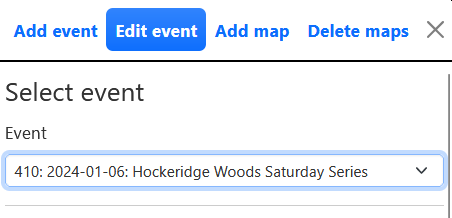
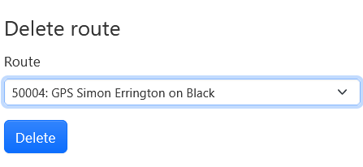
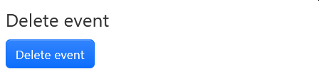

Select the required event in the dropdown.

## Edit event details

This allows you to modify the following details about the event:

- Event name
- Club
- Date
- Level
- Comments
- Read-only (drawing not enabled) or unlocked (drawing enabled)

## Delete route

This allows you to select and delete routes. It was required historically since a user had no way of deleting their own route if they made a mistake. Now that users can delete routes this function should be needed much less.

## Delete event

This allows you to select and delete an event. This is normally only required if you set up an event and then discover a problem with it (wrong map, results or course file for example).

## Editing results

One of the most common feature requests is to have the ability to modify results after an event has been set up. Unfortunately this is very complicated to implement in a robust way. It is something that may get added in future.
