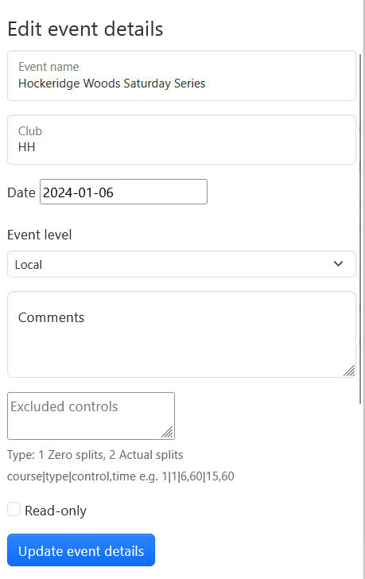
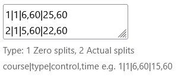

Select the required event in the dropdown.

## Edit event details

This allows you to modify the following details about the event:

- Event name
- Club
- Date
- Level
- Comments
- Excluded controls
- Read-only (drawing not enabled) or unlocked (drawing enabled)

## Excluded controls

This is an experimental feature that allows you to define controls that have been excluded from the results, such as road crossings.

This example shows controls 6 and 25 excluded from Course 1 and controls 5 and 22 excluded from Course 2, each with a maximum allowance of 60 seconds. The results file is of type 1, where the excluded controls are shown with a dummy split of 0 or 1 seconds. The course number is the position of the course in the list as shown on the `Courses` tab.

:::info
The main benefit of defining exclude controls is that the statistics analysis for the course makes more sense and time loss assessments are more accurate. It also means that the autofit function for GPS routes works more sensibly.
:::

## Delete route

This allows you to select and delete routes. It was required historically since a user had no way of deleting their own route if they made a mistake. Now that users can delete routes this function should be needed much less.

## Delete event

This allows you to select and delete an event. This is normally only required if you set up an event and then discover a problem with it (wrong map, results or course file for example).

## Editing results

One of the most common feature requests is to have the ability to modify results after an event has been set up. Unfortunately this is very complicated to implement in a robust way. It is something that may get added in future.
