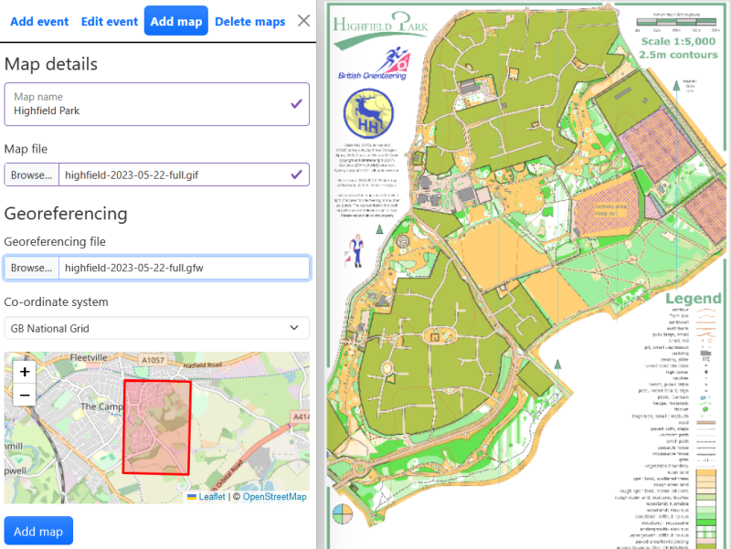
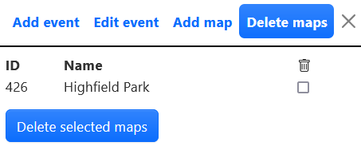

## Adding a map

The map tab allows you to add a new map.

### Map file

Add the following details:

- Map file name: This name is only used within the manager and can be whatever you want.
- Map file: Select the relevant map file to be uploaded. There is [guidance on how to create map files](#map-file-guidance) below.

### Georeferencing

If the map is georeferenced then it is possible to read in the associated world file. This allows alignment of courses and GPS files.

Select the required co-ordinate system from the dropdown. Nearly all routegadget.co.uk installations will use GB National Grid (EPSG:27700).

The small map that opens when you add georeferencing shows you the orienteering map area overlaid on Open Street Map. This allows you to check you have the correct files.

:::info
If the map is not georeferenced then just ignore this section. You will need to adjust control locations manually when setting up the event.
:::

### Uploading the map

When everything is correctly set up click "Add map". The map is saved and a new id is generated.

## Deleting unused maps

The Delete maps tab allows you to delete maps that have been uploaded but are not being used by an event.

Select the checkbox next to each map that you want to delete and then click "Delete selected maps".

:::info

This frees up storage space on the server. There is no problem in having unused maps and Routegadget will work correctly even if you never use this function.

:::

## Map file guidance

### Map file formats

RG2 supports JPG and GIF files. The original Routegadget converted all maps to JPG. RG2 now keeps a GIF file if that is what was initially uploaded, which allows smaller file sizes. It also creates a JPG file from the GIF file for compatibility with the original Routegadget.

### Map file size

There is a balance between the size of the map file (bigger means that it will load slower) and the quality of the map as displayed in Routegadget, especially when zoomed in.

Most map files will probably be exported from OCAD. Recommended settings are to export as a GIF at 150 or 200 dpi. This is OK even for very detailed maps, and gives reasonable file sizes. Nearly all events should be able to get to a file size of under 1Mb without compromising the map quality. Try to avoid files over about 2Mb since these take a long time to load (especially on mobile devices) and offer little benefit.

Other things to consider:

- There is little point in going above 200 dpi. It just increases the file size and makes the course overprint appear very small, without any useful increase in image quality.
- If you do use JPG then set the quality down to 50% or lower. Again this doesn't have a great impact on image quality, but does reduce the file size.

One of the added benefits of Routegadget is being able to compare a wide range of map layouts and cartographic styles. Maps were often cropped so that just the area used for the courses is visible. This is almost certainly because of worries about file size. If you follow the guidelines above you should be fine even for A3 maps, so please try to use the whole map if possible.

### Creating a world file

A [world file](http://en.wikipedia.org/wiki/World_file) is a text file that defines how to translate an image to real-world co-ordinates. Various methods of creating world files are available. A method using OCAD is described below, since this is probably the most likely for orienteering purposes.

The OCAD map must be georeferenced. You can check by selecting "Map|Set scale and co-ordinate system..." The "real world co-ordinates" button must be checked, and a co-ordinate system must be defined.

You can then export the map by selecting "File|Export..." Select the required format (JPEG or GIF) in the dropdown box and make sure the "Create World file" checkbox is ticked. Now when you select "Export" you will get an image file and the associated world file. The world file will have a suffix of .jgw (for jpg images) or .gfw (for gif images).
