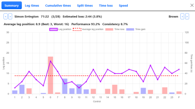
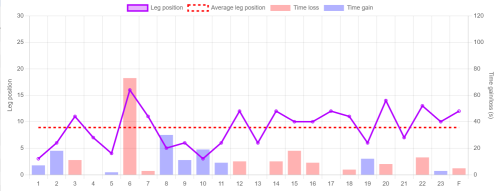

Routegadget provides several functions to allow you to analyse your run in detail.

## Performance analysis

### Displaying performance information

The analysis window can be displayed by clicking the Stats icon in the icon bar at the top of the screen. 

Double clicking on any runner in the Results table will bring up a detailed performance analysis for that runner.

### Summary

The Summary tab displays key aspects of the runner's performance.

The Performance figure provides an indication of how the runner compares to others on the course. The higher the Performance the better the run. A value of 100% indicates that the runner is running at the same speed as the average of the top 25% of runners.

The Consistency figure provides an indication of how the runner's performance varied across each leg. The lower the figure the more consistent the run.

Performance and Consistency are based on a similar calculation used in [Winsplits](http://obasen.orientering.se/winsplits/default.aspx?lang=en).

### Performance chart

The Performance chart on the Summary tab shows how the runner performed throughout the race. The solid red line shows position on each leg and the red dotted line shows average leg position across the whole race. The green bars show estimated time loss at each control.

:::tip
If your mouse is over the chart and you use the scroll wheel you can move through all the runners on that course.
:::

### Leg times

### Cumulative times

### Splits

The Splits tab includes full splits for all runners on the course, as well as performance, consitency and time loss estimation.

First, second and third split and cumulative times for each control are shown in blue, red and green text.

Splits with an estimated time loss of 20 seconds or over are highlighted with a pale red background.

### Time loss

The time loss chart shows how all runners on the course performed for a given control. The dark bar is the currently active runner. Estimated time loss is highlighted in red.

:::tip
You can change the displayed control by using the scroll wheel when your mouse is over the chart.
:::

## Route choice measurement

Clicking on the `Ruler` icon in the icon bar brings up a measurement window.

Click at a start point and any intermediate points to define the route to be measured. Double click to end the line and start a new one, or click the Save icon next to the route.

Drawn routes can be adjusted by dragging the filled circles.

:::info
Lengths are shown in metres for georeferenced maps or in pixels otherwise.
:::

Drawn routes can be deleted individually or all together by clicking the appropriate `Dustbin` icon.

## Splitsbrowser

import SplitsbrowserSvg from '/img/splitsbrowser.svg';

<SplitsbrowserSvg />

Clicking the Splitsbrowser icon in the Icon toolbar will open a new tab for Splitsbrowser analysis.
