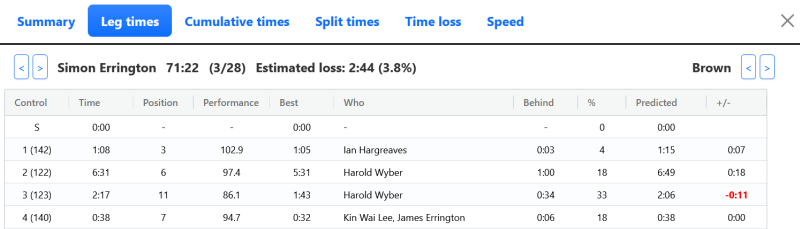
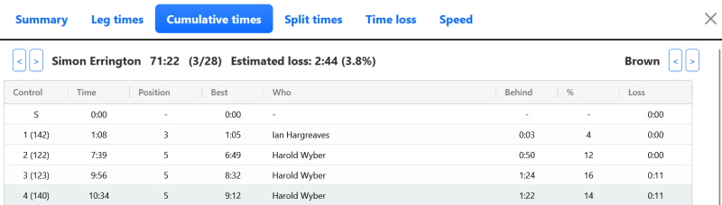
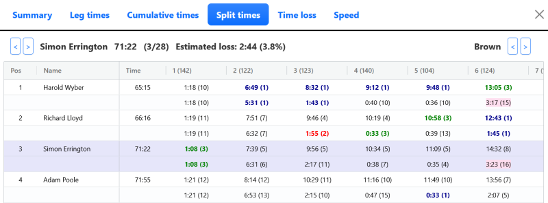

Routegadget provides several functions to allow you to analyse your run in detail.

## Performance analysis

### Displaying performance information

The analysis window can be displayed by clicking the Stats icon in the icon bar at the top of the screen. 

Double clicking on any runner in the Results table will bring up a detailed performance analysis for that runner.

### Summary

The Summary tab displays key aspects of the runner's performance.

The Performance figure provides an indication of how the runner compares to others on the course. The higher the Performance the better the run. A value of 100% indicates that the runner is running at the same speed as the average of the top 25% of runners.

The Consistency figure provides an indication of how the runner's performance varied across each leg. The lower the figure the more consistent the run.

Performance and Consistency are based on a similar calculation used in [Winsplits](http://obasen.orientering.se/winsplits/default.aspx?lang=en).

### Navigation

The left and right arrows at the top left next to the runner's name allow you to cycle through the results for the selected course.

The left and right arrows at the top right next to the course name allow you to cycle through all the courses.

:::tip
If your mouse is over the chart and you use the scroll wheel you can move through all the runners on that course.
:::

### Performance chart

The Performance chart on the Summary tab shows how the runner performed throughout the race. 

- The solid purple line shows position on each leg.
- The red dotted line shows average leg position across the whole race. 
- The blue bars show estimated time gain at a control.
- The red bars show estimated time loss at a control.

### Leg times

### Cumulative times

### Splits

The Splits tab includes full splits for all runners on the course, as well as performance, consistency and time loss estimation.

First, second and third split and cumulative times for each control are shown in blue, red and green text.

Splits with an estimated time loss of 20 seconds or over are highlighted with a pale red background.

Rows for the active runner are highlighted with a pale purple background.

### Time loss

The time loss chart shows how all runners on the course performed for a given control. 

- The red dotted line is the reference time used as a basis of time predictions for this control.
- Runners who performed better than predicted have a green bar showing acual time with a blue top showing the estimated time gained.
- Runners who peformed worse than predicted havd a purple bar showing predicted time with a red top showing the estimated time lost.
- The dark bar is the currently active runner. 

:::tip
You can change the displayed control with the left and right arrows at the top left of the tab or by using the scroll wheel when your mouse is over the chart.
:::

### Speed

The speed tab provides a breakdown of running speed for each leg. 

Length shows the straight-line distance between controls.

Route shows the distance along the runner's route. For GPS routes this is derived using the split times to index the route.

The % column shows the ratio of route length to straight line length. In theory this should never be less than 100%. However, determining the route length is subject to several potential inaccuracies including:

- control time synchronisation
- mapping distortions and errors
- inaccurate GPS routes
- GPS recording that was not started at the start time
- excluded controls (e.g. road crossings).

:::info

For georeferenced maps the Speed tab uses lengths in metres and speeds in minutes per kilometre. Otherwise it uses lengths in pixels and speeds in pixels per minute. These pixels per minute values are shown in brackets to highlight that they are not true speed values, even though they sometimes apper to be reasonable.

:::

:::info
If there is no route for this runner then the final three columns will be empty.

:::

## GPS routes

GPS routes can be configured to be [displayed using colour coding](configuration-options#show-gps-speed-colours). Colours range from green to red as defined by the speed settings. Anything slower than the red speed setting is shown as blue.

The GPS route display also includes small purple circles. These are drawn based on split times to show where the controls were punched.

:::tip

Adjusting the speed settings can be very informative. It becomes easy to see the impact of hills, thick vegetation and rough terrain.

:::

:::info

The dots are not shown for score courses, relays, or for normal courses after the first excluded control (e.g. road crossings). 

:::

## Route choice measurement

Clicking on the `Ruler` icon in the icon bar brings up a measurement window.

Click at a start point and any intermediate points to define the route to be measured. Double click to end the line and start a new one, or click the Save icon next to the route.

Drawn routes can be adjusted by dragging the filled circles.

:::info
Lengths are shown in metres for georeferenced maps or in pixels otherwise.
:::

Drawn routes can be deleted individually or all together by clicking the appropriate `Dustbin` icon.

## Splitsbrowser

import SplitsbrowserSvg from '/img/splitsbrowser.svg';

<SplitsbrowserSvg />

Clicking the Splitsbrowser icon in the Icon toolbar will open a new tab for Splitsbrowser analysis.
