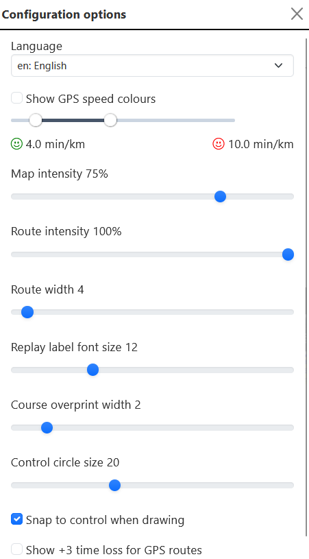

The Configuration options dialog is opened by the cog icon in the Icon bar.

## Language

A dropdown selection showing available translations.

## Map intensity

This allows the map to be dimmed so that it is easier to see courses and routes.

:::tip

Dimming the map can be particularly useful for urban and sprint areas.

:::

## Route intensity

This allows displayed routes to be dimmed.

## Route width, Font size, Overprint width, Circle size

These options allow various display settings to be configured. They may be of use if the map image used for the event has been exported at too high a resolution, which can cause these items to appear very small.

## Snap to control

This checkbox controls how close you need to be to a control when drawing a route. If checked then any click close to the control location (within 8 pixels) is sufficient. If unchecked then you need to click much closer to the control location (within 2 pixels).

## Show +3 time loss of GPS routes

If checked then a GPS route display will show "+3" (or some higher multiple of 3) at locations where the GPS track shows a runner is stationary.

## Show GPS speed colours

If unchecked then GPS routes are shown in a solid colour as for drawn routes.
If checked then GPS routes are colour coded to show running speed. Colours range from green to red as defined by the speed settings. Anything slower than the red speed setting is shown as blue.

:::tip

Adjusting the speed settings can be very informative. It becomes easy to see the impact of hills, thick vegetation and rough terrain.

:::
