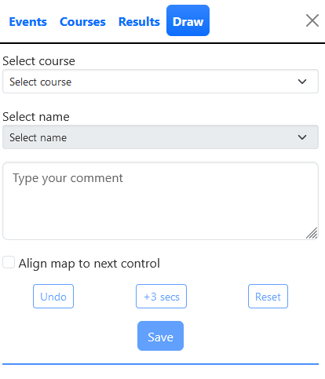
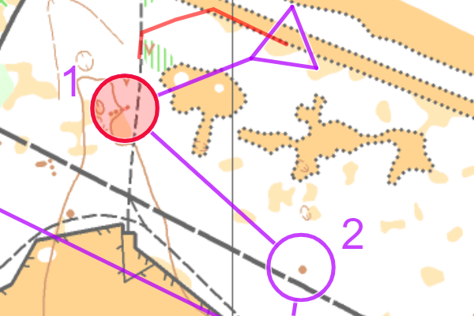
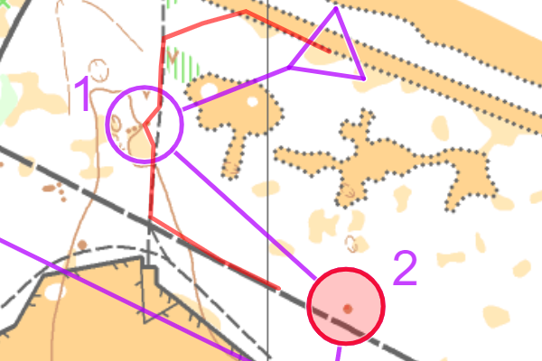
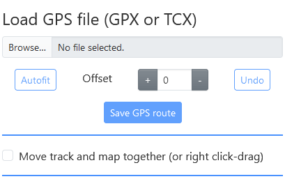
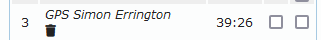

The Draw tab allows you to draw your route or to upload a GPS file.

:::info

If you have an event loaded but the Draw tab is not active then the event has been set up as read-only. There will also be a `Padlock` icon in the title bar.

:::

## Adding a drawn route

### Stages of drawing a route

1. Select your course from the dropdown menu.

2. Select your name from the dropdown menu.

3. Add any comments in the comment box.

4. Draw your route.

5. Once you have completed the route the `Save` button will be enabled. Click on `Save` and then confirm that you want to save the drawn route.

6. Your route can now be viewed from the Results tab.

### Drawing

The next control is highlighted in red. Draw by clicking along your route.

Once you click on the control it will automatically move on to the next one.

:::tip

You can adjust how close you need to click to a control from the configuration dialog.

:::

### Aligning the map

The map will normally be aligned to north when drawing. If you check the `Align map to next control` option then the next control will always be placed at the top of the screen which can make it easier to see and draw where you went.

## Adding a GPS route

### Stages of uploading a GPS route

1. Select your course from the dropdown menu.

2. Select your name from the dropdown menu.

3. Add any comments in the comment box.

4. Select `Choose file` and select the [GPS file](#gps-file-formats) to be uploaded.

5. [Adjust the GPS route](#gps-route-adjustment) as necessary.

6. Once you have completed the adjustment click the `Save` button and then confirm that you want to save the route.

7. Your route can now be viewed from the Results tab.

### GPS file formats

Routegadget supports two GPS file formats:

- `GPX` which can be exported from many systems including Garmin Connect and Strava.
- `TCX` as generated by Garmin Training Centre

:::info
Routegadget does not include any functionality to edit GPS files. If you have started your watch early or stopped it late and want to remove this from the uploaded route then you will need to edit it before upload to Routegadget.
:::

### GPS route adjustment

When you upload a file it is initially fitted to the course as closely as possible. Adjustment handles (small dots) are added at the start and end of the route. These are green when free to move and red when locked. Left click on a handle to toggle the lock. You can stretch and rotate around a single locked point, or between two locked points.

### GPS autofit

There is an autofit function available which will attempt to fit your GPS route to your course. This usually works reasonably well, but it relies on splits being correct and all the controls being synchronised to the same time. It allows for an offset of up to 20 seconds between the start of the GPS file and the actual start time. You can try manually adjusting this offset to find a better fit.

:::tip
If you do use autofit then you should always manually adjust the start and end of the route since these are often quite different to the positions defined in the course file.
:::

## Deleting a route

You can delete a route that you have drawn or uploaded by clicking on the dustbin icon next to it.

:::info
The dustbin icon will only be present on the device that you used to draw or upload the route. This prevents people deleting random routes.
:::
