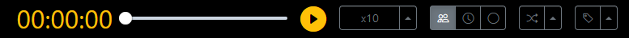
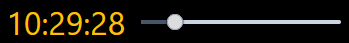
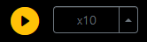
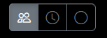
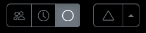
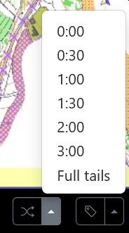
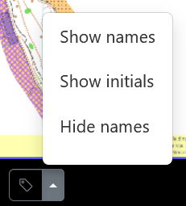

The replay control panel is only displayed if one or more runners have been selected for replay on the Results tab. It is shown along the bottom of the screen.

:::tip
A runner can be selected for replay even if they have not drawn or uploaded a route. Replay will show them going in a straight line between controls.
:::

## Replay clock

The clock displays elapsed time or real time depending on which relay option is chosen. You can use the slider to move to a specific time in the replay.

## Replay controls

These controls allow you to start and stop the replay and control the speed that it runs at.

## Replay type

The three options available are:

- Mass start
- Real time
- By control: This simulates a mass start for each control in turn. Once all runners reach a control the replay halts and you need to press the `Play` icon to start the next leg.

## Replay from

If you have selected `By control` then an icon is displayed that allows you to select which control to start from.

## Tails display

The `tails` icon controls the display of tails on the replay. Tail length of a specific time can be set, or `Full tails` can be selected which shows a full line from the start to the current position.

## Labels

The `labels` icon allows selection of how labels are shown the display:

- Full name
- Initials
- No label.
