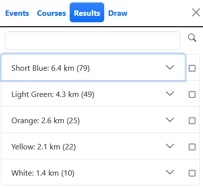
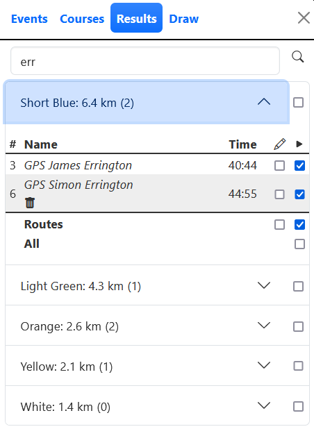
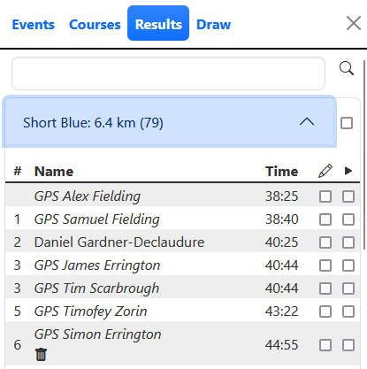
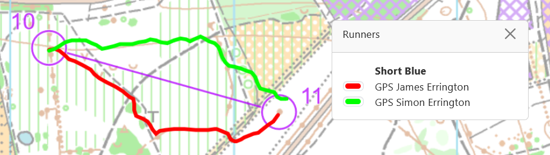

The Results tab shows all results grouped by course. The checkbox next to a course name shows or hides the course on the map. The straight line course length is shown if the map is georeferenced. The number in brackets shows the number of runners on the course.

:::tip

The Results tab is only enabled if you have an event loaded.

:::

## Search

The search bar allows you to filter results. The number in brackets shows the number of runners that match the search pattern for each course.

## See results for course

Click on a course name to expand it and see the results for that course.

Runners who entered a comment when they drew their route are shown underlined. You can read the comment by hovering your mouse over the runner name.

:::tip

You can read all comments for an event on the `Information` dialog accessed from the question mark icon in the top right of the screen.

:::

## See route

Runners who have drawn their route have a checkbox under the `Pen` icon. Use this to show or hide the route. GPS routes are indicated with a `GPS` prefix and the name is in italics.

The `Runners` window displays the names of all selected runners. Click on the coloured bar next to a runner to choose a different colour if needed.

## Select runner for replay

Select runners for replay using the checkbox at the end of the row headed by the `Play` icon.
