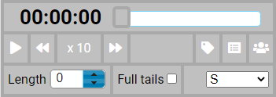
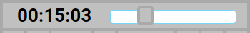
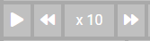
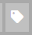
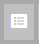
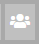
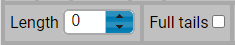
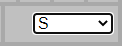

The replay control panel is only displayed if one or more runners have been selected for replay on the Results tab. It is shown in the bottom right corner of the screen.

:::tip
A runner can be selected for replay even if they have not drawn or uploaded a route. Replay will show them going in a straight line between controls.
:::

## Replay clock

The clock displays elapsed time or real time depending on which option has been chosen. You can use the slider to move to a specific time.

## Replay controls

These controls allow you to start and stop the replay and control the speed that it runs at.

## Labels

This toggles through three options for the labels used on the display:

- Full name
- Initials
- No label.

## Splits display

This brings up a splits display for all selected runners.
:::tip
This function has largely been superseded by the splits display in the [performance information](/docs/user-guide/analysis-options#performance-analysis).
:::

## Replay type

Replay with all runners starting at the same time.

Replay in real time.

## Tails display

This controls the display of tails on the replay. Tail length can be set in one minute increments, or full tails can be selected which shows a full line from the start to the current position.

## Replay from

This dropdown allows you to simulate a mass start of all displayed runners from the selected control.

It also includes a `By control` option. This replays a mass start from each control in turn.
